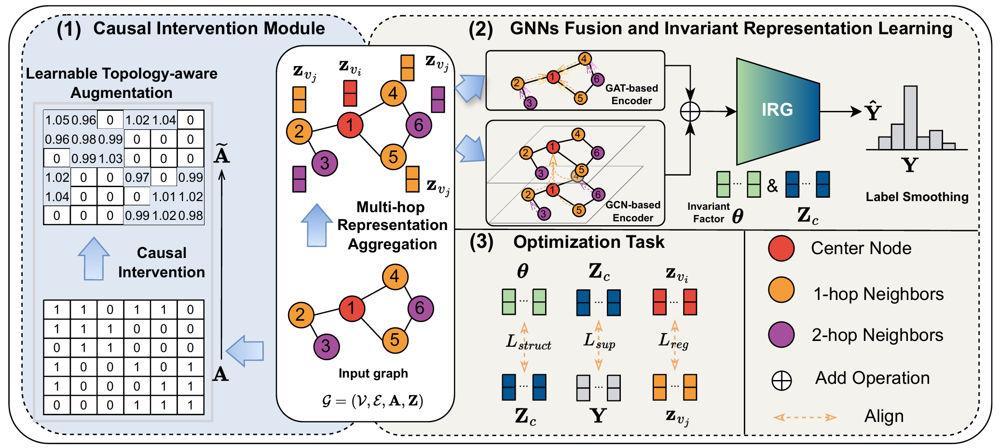

# Causal Intervention with Topology Augmentation for Node-Level Out-of-Distribution Generalization on Graphs [Pattern Recognition 2026]

## 📖 Abstract
Out-of-distribution (OOD) data lead to degradation of the generalization performance of graph neural networks (GNNs) in the node classification task. These data arise from distribution shifts in the structure or features of graphs between the training and test data. Recent studies have attempted to mitigate such degradation by leveraging real or virtual environment labels. However, such environment labels can be unavailable or noisy, encouraging GNNs to exploit shift-variant spurious patterns rather than causal relationships. To address this issue, we apply the frontdoor criterion from causal theory to intervene on the input graph. This criterion uses the ego-subgraph and node representations to achieve the estimation of causal effects without any environment labels. Specifically, we propose a causal intervention framework with topology augmentation to achieve OOD generalization of GNNs. Based on a latent invariant assumption, the augmentation module intervenes on the raw ego-graph to extract a subgraph, after which the framework fuses multi-scale representations from GCN and GAT encoders. Moreover, a generator is designed to learn invariant representations of the extracted subgraph. Three loss functions are derived from this criterion to support node-level deconfounding. Extensive experiments on five benchmark node classification datasets demonstrate that CITA outperforms baselines, with robust generalization under three types of distribution shift and significantly lower training time and GPU memory consumption than a representative virtual label-based method. 

<p align="center">
  
  <br>
  <em>Figure 1: Overview of the proposed CITA framework.</em>
</p>


## 🚀 Main Contributions
- We study the under-explored problem of node-level OOD generalization in GNNs and highlight the limitations of relying on real or virtual environment labels.
- We propose a novel framework Causal Intervention with Topology Augmentation (CITA) for node-level OOD generalization. It performs structural intervention on graph topology to mitigate confounding effects and learn node-level invariant ego-subgraph representations. Three loss functions are derived from the frontdoor-based objective to support node-level deconfounding.
- We conduct extensive empirical evaluations on five benchmark datasets, showing that CITA achieves strong OOD generalization and requires lower training time and GPU memory usage than a representative virtual label-based causal method. In addition, visual case studies further demonstrate the node-level interpretability of our framework.


## 📄 Citation

If you find this work useful for your research, please cite our paper:

```bibtex
@article{YANG2026114616,
title = {Causal intervention with topology augmentation for node-level out-of-distribution generalization on graphs},
journal = {Pattern Recognition},
volume = {180},
pages = {114616},
year = {2026},
author = {Lianqiang Yang and Bowen Lu and Teng Li and Yunfei He and Kun Zhang}
}
```
